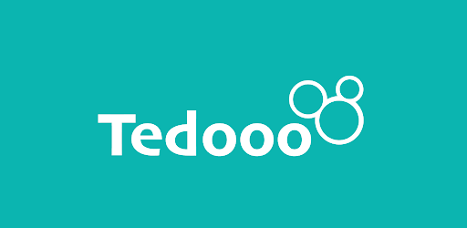

# Tedooo Assignment Project
<a name="readme-top"></a>

<div align="center">
    <a href='https://www.tedooo.com/'></a>

  <p align="center">
    <a href="https://github.com/wajdi-amer/tedooo-assignment">View Demo</a>
    ·
    <a href="https://github.com/wajdi-amer/tedooo-assignment/issues">Report Bug</a>
  </p>
</div>

</br>

<details>
  <summary>Table of Contents</summary>
  <ol>
    <li>
      <a href="#about-the-project">About The Project</a>
      <ul>
        <li><a href="#built-with">Built With</a></li>
      </ul>
    </li>
    <li>
      <a href="#how-to-run">How to Run</a>
      <ul>
        <li><a href="#prerequisites">Prerequisites</a></li>
        <li><a href="#installation">Installation</a></li>
      </ul>
    </li>
    <li><a href="#contact">Contact</a></li>
  </ol>
</details>

</br>
</br>

## About The Project
This project was developed as a home assignment from <a href='https://www.tedooo.com/'>Tedooo</a>.
</br>

### Built With:
[![React][React.js]][React-url]


<p align="right">(<a href="#readme-top">back to top</a>)</p>


## How to Run

To get a local copy up and running follow these simple example steps.

<br/>

### Prerequisites

* npm
  ```sh
  npm install npm@latest -g
  ```

### Installation

1. Clone the repository

   ```sh
   git clone https://github.com/wajdi-amer/tedooo-assignment.git
   ```

2. Navigate to the 'client' folder
   ```
     cd ./client
   ```
3. Run 'npm ci' to install the required dependencies

   ```
     npm ci
   ```
4. Run 'npm start'

   ```
     npm start
   ```

<p align="right">(<a href="#readme-top">back to top</a>)</p>

## Contact

Wajdi Amer - wajdi.amerrr@gmail.com

LinkedIn - https://www.linkedin.com/in/wajdi-am/


<p align="right">(<a href="#readme-top">back to top</a>)</p>


[React.js]: https://img.shields.io/badge/React-20232A?style=for-the-badge&logo=react&logoColor=61DAFB
[React-url]: https://reactjs.org/